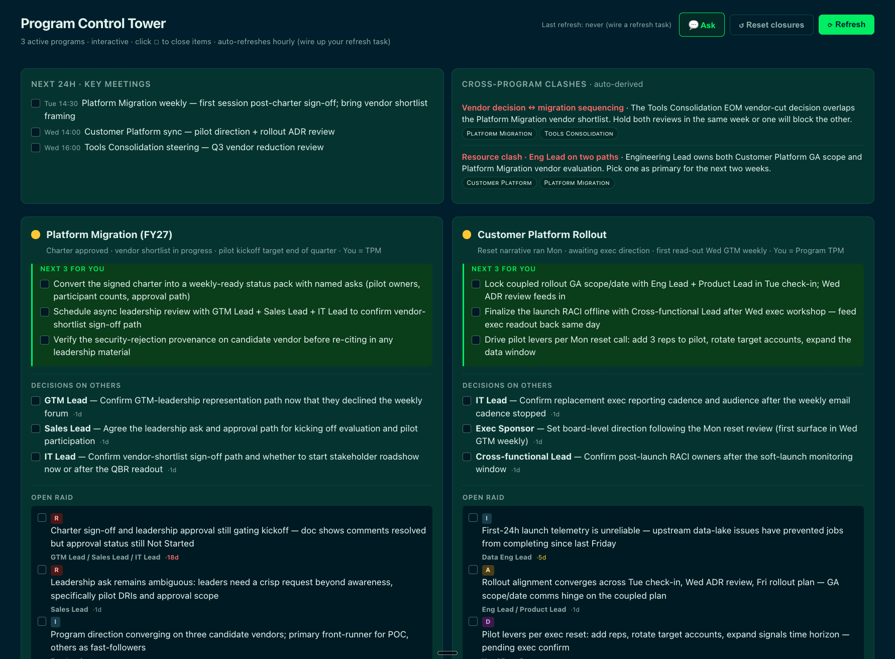
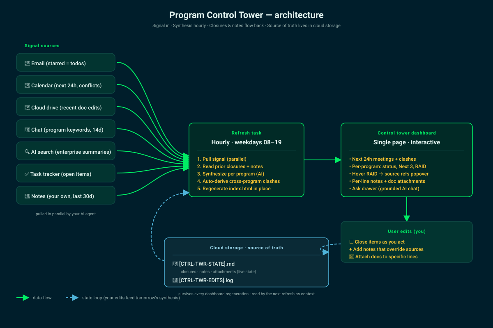

# Program Control Tower

> A single-file dashboard for program / project managers running 3–6 workstreams in parallel. An AI agent synthesizes signal from your tools every hour; you scan one page in five minutes; your closures and notes flow back as context for tomorrow's synthesis.

**Live demo:** [edoard0.github.io/program-control-tower](https://edoard0.github.io/program-control-tower) — click around. State persists to `localStorage`; nothing leaves your browser.



## Why

Most PMs start the day reconstructing context from 7 tools: email, drive, calendar, chat, enterprise search, task tracker, and their own notes. Forty-five minutes before you're actually thinking. Status reports don't help — they're snapshots, not synthesis, and they don't remember what you've already handled.

This is a different shape: a regenerated dashboard with durable state. Closures stick. Inline notes override the AI's read of source documents. The system gets sharper the longer you use it.

## Quickstart

```bash
git clone https://github.com/edoard0/program-control-tower.git
cd program-control-tower
open index.html
```

That's it. Closures, notes, and doc attachments work immediately via `localStorage`. To make it real — connect it to your tools — see [SETUP.md](SETUP.md).

## Architecture



Two halves:

1. **The page** (`index.html`) — single file. Inline CSS and JS. State persists to `localStorage` immediately and (when you wire it up) syncs to cloud storage.
2. **The refresh task** — a scheduled job running outside the browser that pulls signal in parallel, reads your prior closures/notes as context, synthesizes per program with an AI model, and regenerates `index.html` in place.

The clever bit is the *state loop*: your closures and notes live in two markdown files in cloud storage (`[CTRL-TWR-STATE].md`, `[CTRL-TWR-EDITS].log`), not in the HTML. Every regeneration of `index.html` reseeds from that snapshot, so you never lose your edits — and tomorrow's synthesis reads them as context, so the AI knows what you've already handled and what you've corrected.

## Features

- **Hourly auto-refresh** — the page is regenerated by your scheduled task; you scan it like email.
- **Per-program status** — green/yellow/red dot, Next 3 actions, Decisions on others, open RAID, "What's hot" prose, refs to the source docs.
- **Cross-program clashes auto-derived** — resource collisions, schedule conflicts, sequencing dependencies.
- **Click ☐ to close items** — closures persist across regenerations.
- **+ note** per line — your inline context overrides the AI's read of the docs.
- **+ doc** per line — attach any URL to a specific line; title fetched from your storage API.
- **Hover RAID items** — popover shows the program's full source refs.
- **Ask drawer** (Cmd/Ctrl+K) — chat grounded in the live dashboard state, sends a snapshot to your AI of choice.

## Wiring it up

The script has four clearly-marked integration points. Search the source for `WIRE:`:

| Marker | What it does |
|---|---|
| `WIRE: REFRESH` | Trigger your scheduled refresh task on demand from the toolbar button. |
| `WIRE: STORAGE` | Push state to cloud storage (Drive, OneDrive, Dropbox, S3 — whatever your agent can call). Used to debounce sync after edits. |
| `WIRE: STORAGE` (inside `addAttachment`) | Resolve a pasted URL into a doc title via your storage API's metadata endpoint. |
| `WIRE: ASK` | Send a question + dashboard snapshot to your AI of choice. |

[**Full setup guide → SETUP.md**](SETUP.md) walks through the refresh-task design, the state schema, cloud-storage layout, and optional dual-mode (browser vs. AI-app) support.

## Built with

The template is plain HTML/CSS/JS — no build step, no dependencies, no framework. By design:

- One file is easy to read, fork, and adapt.
- No package manager → no supply-chain attack surface.
- Drops into a static host (GitHub Pages, Vercel, Netlify) with zero config.

The refresh task is yours to build, and the template is intentionally agent-agnostic. The same shape works with any LLM that supports tool-calling and any runtime that can run a scheduled job — Claude (with or without MCP), OpenAI / GPT with function-calling, Gemini, a local model behind an OpenAI-compatible endpoint, Cursor, Aider, n8n, Zapier, a homegrown Python cron script. Pick whichever pairing of model + scheduler + tool integrations fits the rest of your stack.

## License

[MIT](LICENSE) — do whatever you want with it. If you build something, I'd love to hear how it went.

## Credit

Built by a Program Manager who got tired of the morning context-reconstruction loop. If this saved you time, the kindest thing you can do is star the repo and tell another PM about it.
